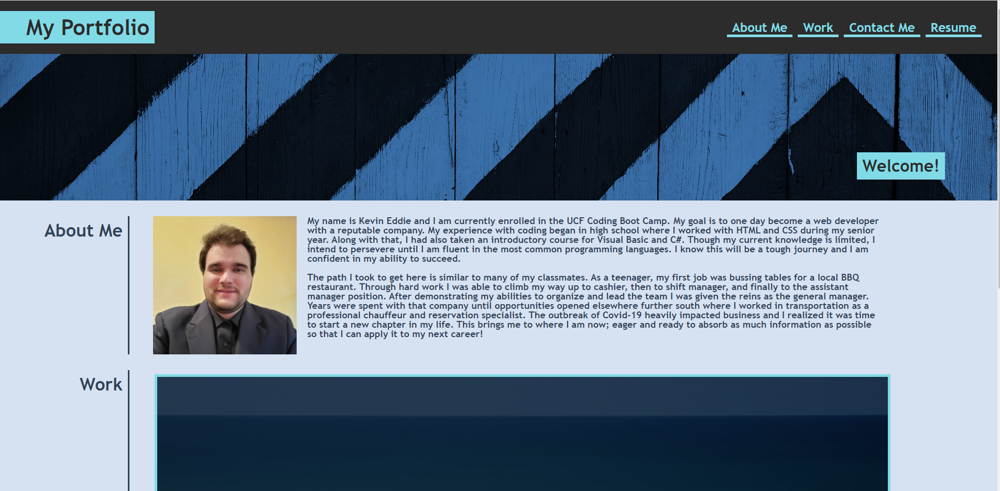
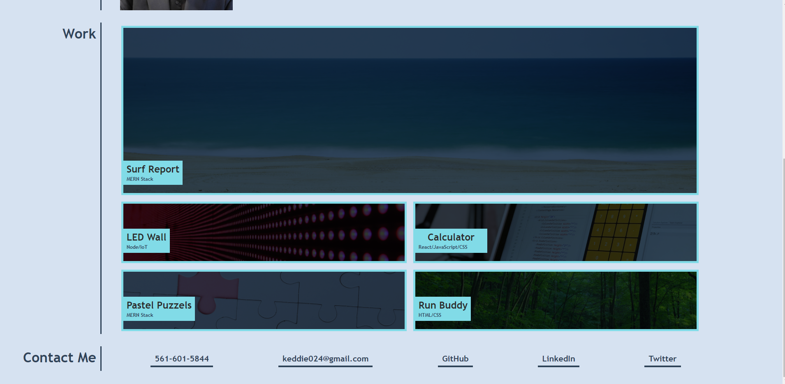

# responsive_portfolio
## My Portfolio // Work in Progress

https://keddie024.github.io/responsive_portfolio/

## 03/23/2021

The first iteration of my portfolio is complete. The code may not be optimized, but the website is responsive and displays properly on mobile devices/tablets. Updates to follow...

## Image Sources

1: https://www.pexels.com/photo/white-and-black-wooden-board-963278/

2: https://unsplash.com/photos/apax4M-4kFI

3: https://www.pexels.com/photo/abstract-business-code-coder-270348/

4: https://www.pexels.com/photo/month-of-january-planner-760718/

5: https://www.pexels.com/photo/pink-jigsaw-puzzle-piece-3482441/

6: https://www.pexels.com/photo/green-tree-beside-roadway-during-daytime-163703/
